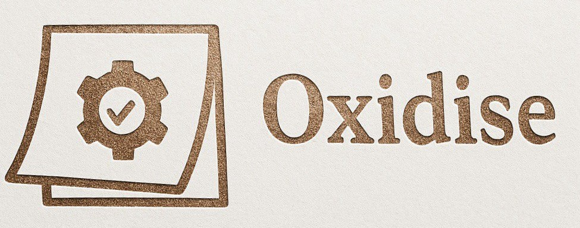

# Oxidize - Task & Todo Manager

[](https://deps.rs/repo/github/itsNiccoloSabatini/Oxidize)
[](https://github.com/itsNiccoloSabatini/Oxidize/actions?workflow=CI)



## 🚀 Purpose

**Oxidize** is a fast, efficient, and intuitive task and todo manager built with Rust and egui. Designed for developers and productivity enthusiasts who want a clean, distraction-free way to organize their tasks and boost their workflow.

## ✨ Key Features

- **Lightning Fast**: Built with Rust for maximum performance and minimal resource usage
- **Cross-Platform**: Runs natively on Windows, macOS, and Linux
- **Clean Interface**: Modern, minimalist UI powered by egui
- **Task Organization**: Create, edit, and manage tasks with ease
- **Priority Levels**: Set task priorities to focus on what matters most
- **Categories & Tags**: Organize tasks by projects or contexts
- **Due Dates**: Never miss a deadline with built-in date tracking
- **Progress Tracking**: Mark tasks as complete and track your productivity
- **Persistent Storage**: Your tasks are safely stored locally

## 🎯 Why Oxidize?

In a world full of complex productivity apps, Oxidize focuses on simplicity and speed. Whether you're managing daily tasks, project milestones, or personal goals, Oxidize provides the essential features you need without the bloat.

Perfect for:

- Developers tracking coding tasks and bugs
- Students managing assignments and deadlines
- Professionals organizing work projects
- Anyone who wants a fast, reliable todo manager

## 🛠️ Tech Stack

- **Language**: Rust
- **GUI Framework**: egui
- **Build Tool**: Cargo
- **Web Support**: Available via WebAssembly

## 🚀 Getting Started

### Prerequisites

- Rust (latest stable version)
- Cargo (comes with Rust)

### Installation

1. Clone the repository:

```bash
git clone https://github.com/itsNiccoloSabatini/Oxidize.git
cd Oxidize
```

2. Build and run:

```bash
cargo run
```

### Web Version

To run in a web browser:

```bash
trunk serve
```

## 📝 Usage

1. **Add Tasks**: Click the "+" button or use keyboard shortcuts to quickly add new tasks
2. **Set Priorities**: Assign priority levels (High, Medium, Low) to organize your workload
3. **Mark Complete**: Check off completed tasks to track your progress
4. **Filter & Search**: Use filters to view specific categories or search for tasks
5. **Edit Tasks**: Double-click any task to edit its details

## 🤝 Contributing

Contributions are welcome! Please feel free to submit a Pull Request. For major changes, please open an issue first to discuss what you would like to change.

## 📄 License

This project is dual-licensed under:

- [MIT License](LICENSE-MIT)
- [Apache License 2.0](LICENSE-APACHE)

## 🔧 Development

### Building from Source

```bash
cargo build --release
```

### Running Tests

```bash
cargo test
```

---

Built with ❤️ in Rust
